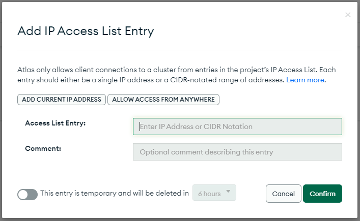
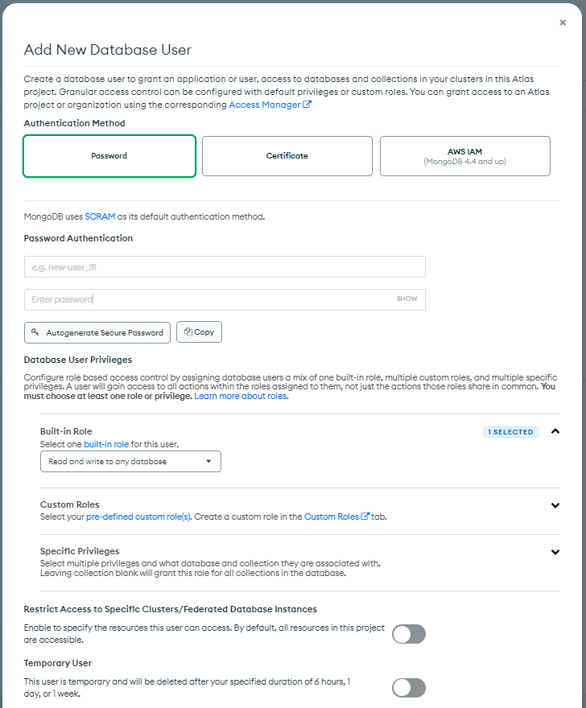
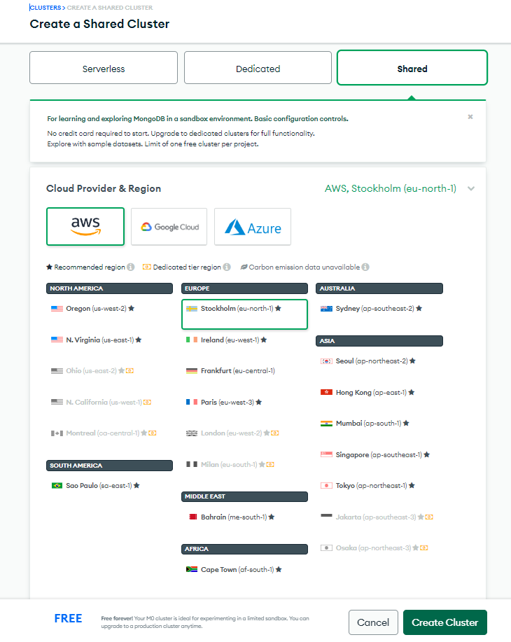
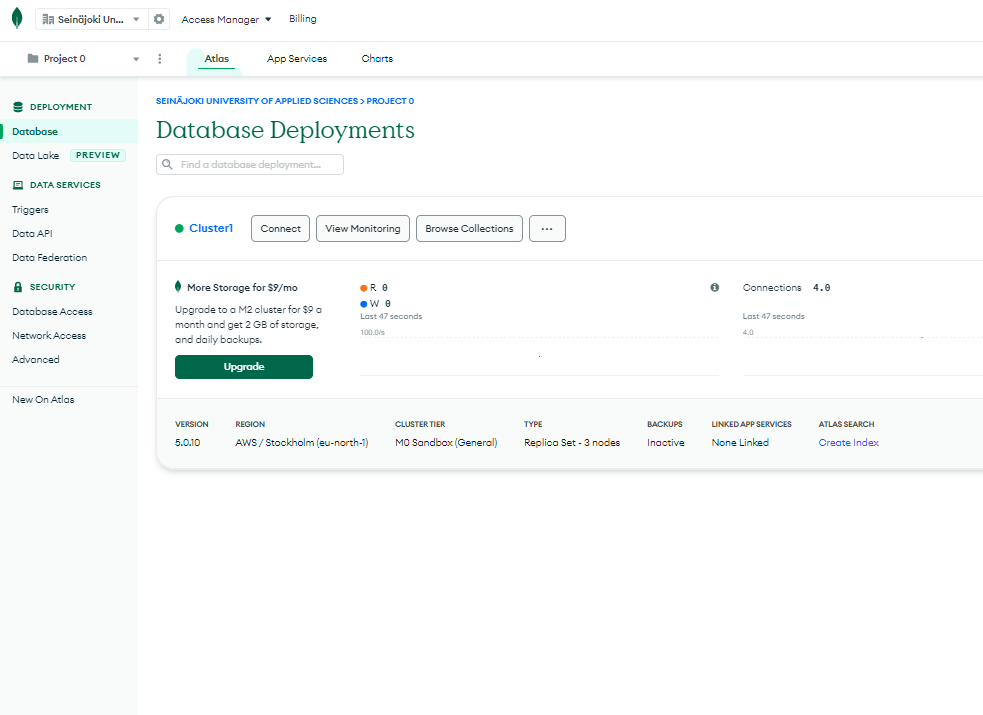
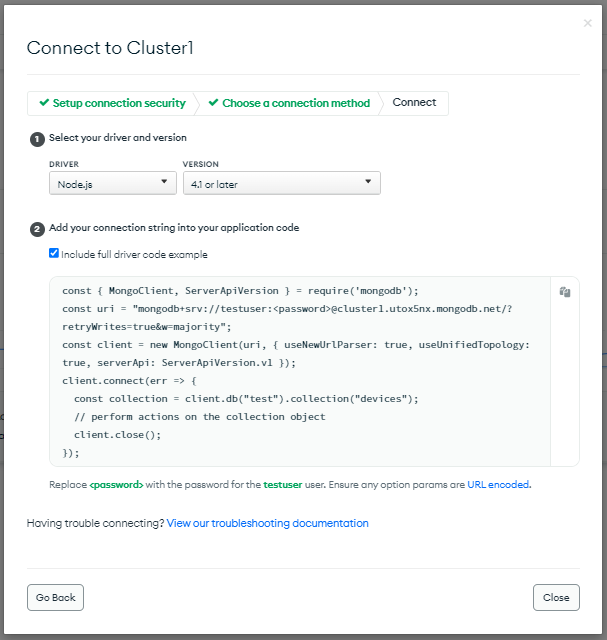

Quick guide to the MongoDB Atlas database

1.  Log in or Sign up to the MongoDB Atlas
    https://www.mongodb.com/atlas/database

Add the IP address to access the database

Select Network Access -\> IP Access List -\> Add IP Address

{width="5.565497594050743in"
height="3.4243000874890637in"}

ADD CURRENT IP ADDRESS and Confirm

2.  Add database user

Select Database Access -\> Add New Database User

{width="6.6930555555555555in"
height="8.090277777777779in"}

Fill Password Authentication username and password fields

3.  New Database

Database -\> Create

{width="6.6930555555555555in"
height="8.407638888888888in"}

Select Shared Cluster and Create Cluster

{width="6.6930555555555555in"
height="3.452174103237095in"}

4.  Example Node.js code

Select Connect -\> Connect your application

{width="6.322916666666667in"
height="6.666666666666667in"}

Copy this example code
